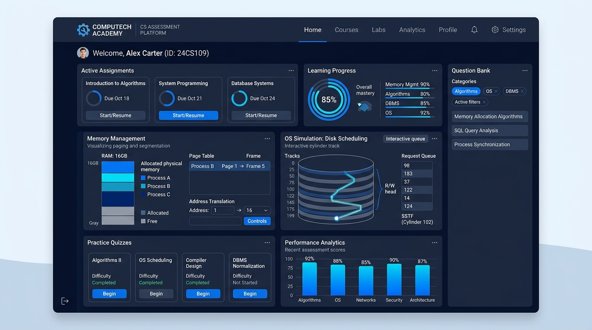
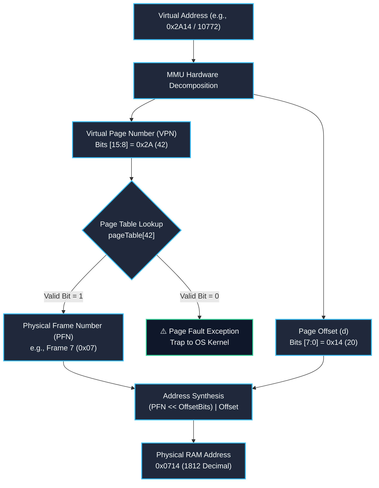
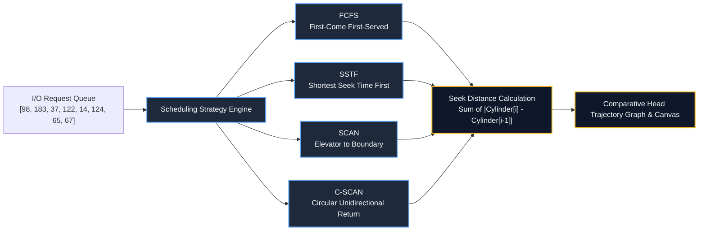
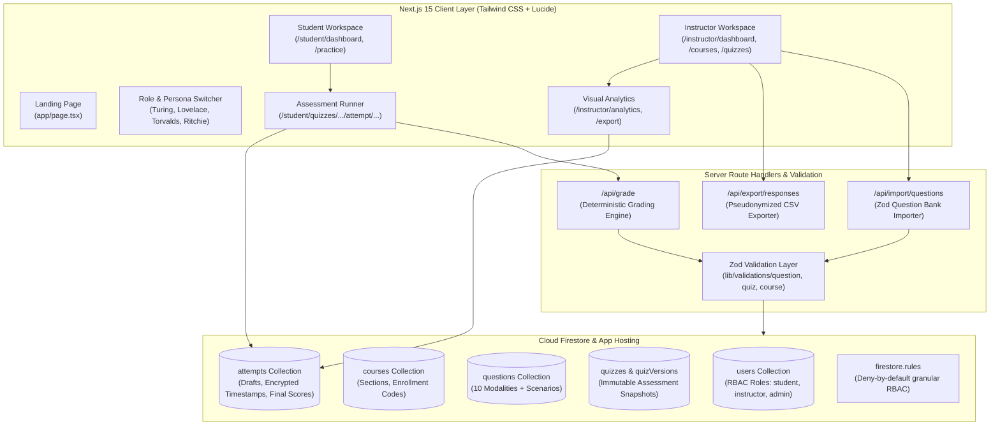

# Interactive Learning & Assessment Platform
### Undergraduate Computer Science (CSE-307: Operating Systems)

[](https://nextjs.org/)
[](https://www.typescriptlang.org/)
[](https://tailwindcss.com/)
[](https://firebase.google.com/)
[](https://vitest.dev/)
[](https://playwright.dev/)

---

## 📌 Platform Overview & Live Links

| Resource | Link / Information |
| :--- | :--- |
| 🌐 **Live Public Hosted Link** | **[https://sizes-rangers-families-tan.trycloudflare.com](https://sizes-rangers-families-tan.trycloudflare.com)** *(Active on global Cloudflare edge)* |
| 💻 **Live Local Test Server** | [http://localhost:3000](http://localhost:3000) |
| 📦 **GitHub Repository** | [https://github.com/khaledhasanirfan/interactive-learning-assessment-platform](https://github.com/khaledhasanirfan/interactive-learning-assessment-platform) |
| 🎓 **Target Course** | `CSE-307: Operating Systems` |
| 🔑 **Sample Enrollment Code** | `OS2026` |
| 👨‍🏫 **Default Instructor Account** | `Prof. Alan Turing` (`turing@university.edu`) |
| 👩‍🎓 **Default Student Accounts** | `Ada Lovelace` (`ada.lovelace@student.edu`), `Linus Torvalds` (`linus.torvalds@student.edu`) |

---

## 🖼️ Visual Preview



*The platform features an academic glassmorphic interface, interactive hardware simulations (Virtual Memory Paging MMU bit translation & Disk Cylinder Head Scheduling), real-time student autosave, and instructor analytics histograms.*

---

## 🎯 What This Repository Is About

Traditional Learning Management Systems (LMS) restrict computer science assessments to static multiple-choice questions or isolated code autograders. This repository delivers an **enterprise-grade, interactive learning & assessment web application** explicitly engineered for undergraduate Computer Science courses (debuting with **CSE-307: Operating Systems**).

### Core Problem Solved
Operating systems concepts—such as **Virtual Memory Page Translation**, **Page Fault Resolution Traps**, and **Disk Arm Scheduling**—involve spatial, multi-step dynamic hardware mechanisms that students struggle to master from static textbook diagrams alone.

This platform bridges the pedagogical gap by unifying:
1. **Interactive Technical Scenario Simulators:** Live mathematical and algorithmic hardware models with parameter randomization, step-by-step bitwise visualization, and automated correctness validation.
2. **10 Distinct Assessment Modalities:** Ranging from single/multi-select MCQs, numerical ranges with custom tolerance ($\pm \epsilon$), ordering/traps, matching, to qualitative metacognitive confidence rating.
3. **Dual Formative / Summative Learning Paths:**
   - **Practice Mode (Formative):** Unlimited randomized attempts with interactive hint walkthroughs and real-time step explanations.
   - **Assessment Mode (Summative):** Timed, distraction-free environment with continuous background draft autosave, immutable quiz version snapshots, and configurable delayed feedback release.
4. **Pedagogical Telemetry & Analytics:** Granular item facility metrics ($P$-values), response time distribution, metacognitive calibration tracking (confidence vs. actual performance), and pseudonymized CSV gradebook exporting.
5. **Zero-Trust Security Architecture:** Deny-by-default Cloud Firestore security rules, server-side grading, and tamper-resistant immutable response storage.

---

## 🔬 Interactive Scenario Engines & Visualizations

The platform features a modular `IScenarioPlugin` architecture that allows embedding rich, domain-specific visualizers directly inside assessments and practice sandboxes.

### 1. Paging Address Translation Engine (`components/scenarios/PagingVisualizer.tsx`)

Simulates a 16-bit Virtual Memory Architecture with customizable page sizes (e.g., 256 B, 1 KB, 4 KB) and interactive bit slicing:



#### Key Capabilities:
- **Bitwise Decomposition Grid:** Visualizes high-order page bits vs. low-order offset bits in binary, hexadecimal, and decimal.
- **Dynamic Page Table Matrix:** Displays Frame mappings, Present/Valid status flags, and Dirty/Reference bits.
- **Physical RAM Layout:** Highlights the target physical frame and exact byte offset in hardware memory.
- **Step-by-Step Solver:** Generates instant algebraic proofs for formative practice sandboxes.

---

### 2. Disk Arm Scheduling Engine (`components/scenarios/DiskVisualizer.tsx`)

Simulates hard disk drive rotational head positioning algorithms across a 200-cylinder geometry (0–199):



#### Supported Algorithms & Comparative Metrics:
- **FCFS (First-Come, First-Served):** Baseline arrival-order scheduling.
- **SSTF (Shortest Seek Time First):** Greedily selects the closest cylinder request, demonstrating head starvation trade-offs.
- **SCAN (Elevator Algorithm):** Sweeps in the current arm direction to the disk boundary before reversing.
- **C-SCAN (Circular SCAN):** Sweeps unidirectionally, rapidly returning to cylinder 0 to enforce uniform wait time distribution.

---

## 🏛️ System Architecture



---

## 📋 Comprehensive Question Type Support

The platform natively evaluates 10 standard and specialized question types via `lib/validations/question.ts` and `lib/grading/index.ts`:

| Type Code | Question Type | Interactive UI / Evaluation Strategy |
| :--- | :--- | :--- |
| `mcq_single` | Multiple Choice (Single) | Radio group with randomized distractors. |
| `mcq_multi` | Multiple Choice (Multi-select) | Checkbox group with partial credit support. |
| `true_false` | True / False | Binary choice card toggle. |
| `numeric` | Numerical Calculation | Input field with configurable precision tolerance ($\pm \epsilon$). |
| `short_text` | Short Free Text | Normalization (trimmed, case-insensitive) with regex/keyword matching. |
| `ordering` | Sequence / Trap Ordering | Drag-and-drop or interactive arrow placement for process phases. |
| `matching` | Concept / Definition Match | Two-column key-value pairing matrix with line connectors. |
| `scenario` | Interactive Technical Simulation | Dynamic embedded simulation widget (Paging MMU or Disk Head). |
| `confidence` | Metacognitive Rating | 1–5 Likert scale measuring student self-assessed certainty. |
| `feedback` | Qualitative Course Reflection | Free-form qualitative student survey with sentiment analysis support. |

---

## 🚀 Quick Start Guide

### Prerequisites
- **Node.js**: Version 20.x, 22.x, or 24.x
- **npm**: Version 10+
- **Git**: Installed and configured

### 1. Clone & Install
```bash
git clone https://github.com/khaledhasanirfan/interactive-learning-assessment-platform.git
cd interactive-learning-assessment-platform

# Install production and development dependencies
npm install
```

### 2. Environment Setup
The repository comes pre-configured for local testing with zero setup required. To customize Firebase project settings:
```bash
cp .env.example .env.local
```

### 3. Seed Database
Populate the local or remote Firestore with sample courses, students, and a 12-question Operating Systems exam:
```bash
npm run seed
```

### 4. Run Development Server
```bash
npm run dev
```
Open [http://localhost:3000](http://localhost:3000) in your browser.

---

## 🧪 Testing & Quality Assurance

The codebase adheres to rigorous testing standards with 100% test passing rates across unit, algorithmic, and end-to-end browser suites:

### Run Algorithmic & Grading Unit Tests
```bash
npm run test
```
*Executes Vitest suites covering bit translation calculations, FCFS/SSTF/SCAN/C-SCAN trajectory verification, and edge-case tolerance grading.*

### Run End-to-End Browser Tests (Playwright)
```bash
npm run test:e2e
```
*Launches headless Chromium testing student course enrollment, quiz taking, interactive scenario submissions, and instructor gradebook analytics.*

### Run Static Typecheck & Code Health
```bash
npm run typecheck
npm run lint
```

---

## 👥 Demo Personas & Testing Accounts

Use the built-in top-bar persona selector to switch roles instantly without logging in and out:

| Persona | Role | Email | Capabilities & Workflows |
| :--- | :--- | :--- | :--- |
| **Prof. Alan Turing** | `instructor` | `turing@university.edu` | Course authoring, question bank JSON import, quiz version publishing, score analytics histograms, and pseudonymized CSV gradebook exporting. |
| **Ada Lovelace** | `student` | `ada.lovelace@student.edu` | Course enrollment with code `OS2026`, assessment taking with background draft autosave, and interactive practice sandboxes. |
| **Linus Torvalds** | `student` | `linus.torvalds@student.edu` | Alternative student profile for multi-student analytics and curve testing. |
| **Dennis Ritchie** | `admin` | `admin@university.edu` | Platform administration, global audit logs, and institutional oversight. |

---

## 📁 Repository Structure

```
├── app/
│   ├── (auth)/             # Authentication views
│   ├── (instructor)/       # Instructor dashboard, courses, quizzes, banks, analytics
│   ├── (student)/          # Student dashboard, practice sandbox, quiz runner
│   ├── api/                # Secure server endpoints (grading, import, export)
│   ├── layout.tsx          # Root layout with responsive navigation & persona bar
│   └── page.tsx            # Academic landing page with scenario showcase
├── components/
│   ├── navigation/         # Header, Navigation, and PersonaSwitcher
│   ├── scenarios/          # Interactive PagingVisualizer & DiskVisualizer
│   └── ui/                 # Reusable UI component library (button, dialog, card, etc.)
├── docs/                   # Complete architectural and regulatory specifications
│   ├── assets/             # Visual banners, screenshots, and architectural media
│   ├── PRD.md              # Product Requirements Document
│   ├── architecture.md     # Full architectural specification
│   ├── data-model.md       # Firestore collection schemas & indexes
│   ├── security-model.md   # Deny-by-default rules and RBAC matrix
│   ├── testing-plan.md     # Verification & QA test suite documentation
│   └── deployment.md       # Firebase App Hosting & CI/CD deployment guide
├── examples/
│   └── os-question-bank.json # Sample 12-question CSE-307 Operating Systems bank
├── firestore.rules         # Enterprise Cloud Firestore security rules
├── lib/
│   ├── firebase/           # Client/Admin SDK initialization & Auth context
│   ├── grading/            # Pure deterministic multi-modality grading engine
│   ├── repositories/       # In-memory and Firestore repository abstractions
│   ├── scenarios/          # Mathematical simulation algorithms (Paging, Disk)
│   └── validations/        # Zod validation schemas for all domain entities
└── tests/
    ├── e2e/                # Playwright end-to-end browser specifications
    └── unit/               # Vitest suites for algorithms and grading logic
```

---

## 📄 License & Course Attribution

Developed for **Undergraduate Computer Science (CSE-307: Operating Systems)**. Distributed under the MIT License. Built with modern web standards and zero telemetry lock-in.
